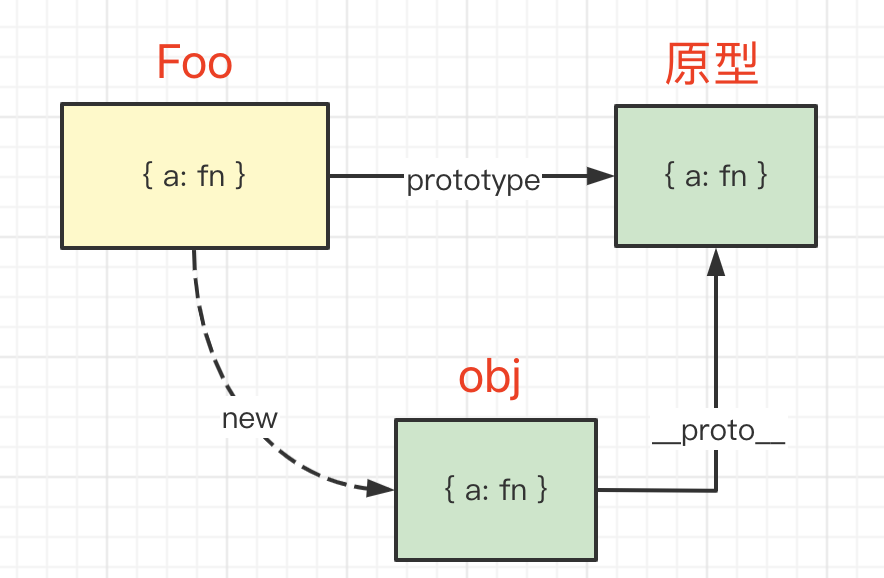

# 原型

## 题目

以下代码，执行会输出什么？

```js
function Foo() {
    Foo.a = function() { console.log(1) }
    this.a = function() { console.log(2) }
}
Foo.prototype.a = function() { console.log(3) }
Foo.a = function() { console.log(4) }

Foo.a()
let obj = new Foo()
obj.a()
Foo.a()
```

## 分析

把自己想象成 JS 引擎，你不是在读代码，而是在执行代码 —— 定义的函数如果不执行，就不要去看它的内容 —— 这很重要！！！

按这个思路来“执行”代码

## 原型



## 答案

执行输出 `4 2 1`

## 重点

- 原型基础知识
- 你不是在读代码，而是在模拟执行代码
