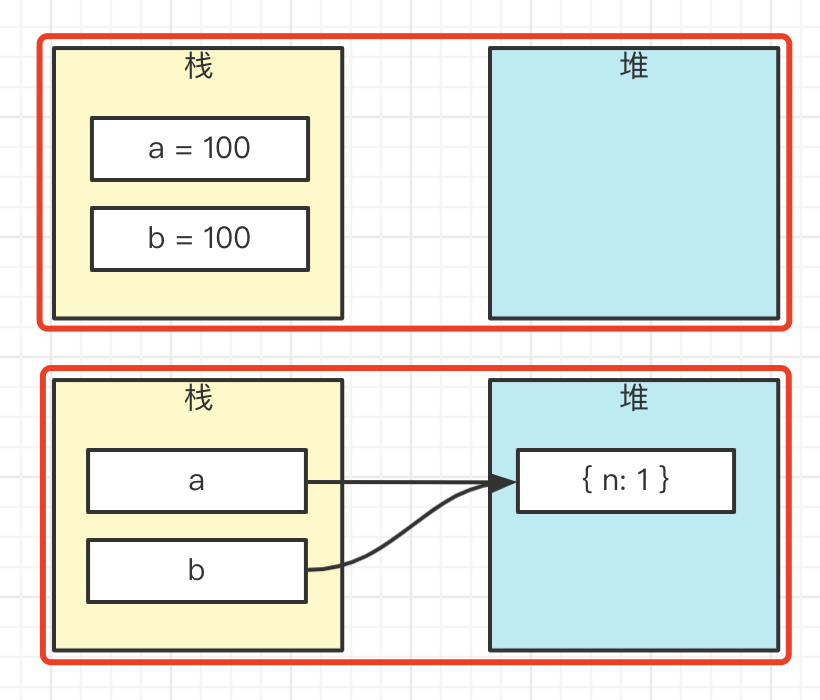
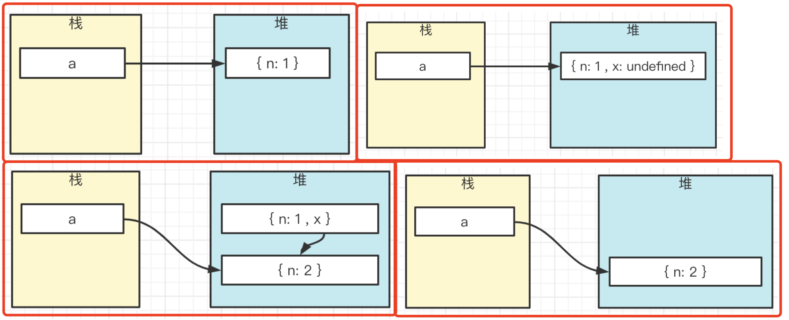

# 对象赋值

## 题目

以下代码，运行会输出什么

```js
let a = { n: 1 }
let b = a
a.x = a = { n: 2 }

console.log(a.x) 	
console.log(b.x)
```

## 值类型 vs 引用类型

```js
let a = 100
let b = a

let a = { n: 1 }
let b = a
```



## 连续赋值

连续赋值是倒序执行。PS：日常工作不可用连续赋值，可读性差

```js
let n1, n2
n1 = n2 = 100

// // 相当于
// n2 = 100
// n1 = n2
```

## `.` 优先级更高

```js
let a = {}
a.x = 100

// 可拆解为：
// 1. a.x = undefined // 初始化 a.x 属性
// 2. a.x = 100 // 为 x 属性赋值

```

再看下面的例子

```js
let a = { n: 1 }
a.x = a = { n: 2 }

// // 可以拆解为
// a.x = undefined
// let x = a.x // x 变量是假想的，实际执行时不会有
// x = a = { n: 2 }
```



## 答案

题目代码执行打印 `undefined` 和 `{ n: 2 }`

其实把 `a.x = a = { n: 2 }` 换成 `b.x = a = { n: 2 }` 更好理解

或者把连续赋值拆分为 `a.x = { n: 2 }; a = { n: 2 }` （优先级高的，先执行）

## 重点

- 值类型和引用类型，堆栈模型
- 连续赋值（`.` 优先级更高）

PS：日常工作不可用连续赋值，可读性差
