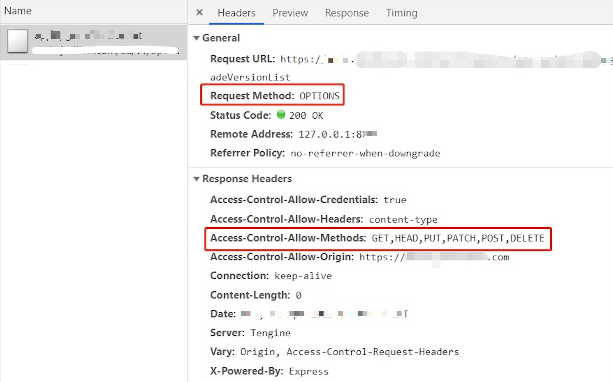

# options 请求

## 题目

跨域为何需要 options 请求？

## 跨域

浏览器同源策略，默认限制跨域请求。跨域的解决方案
- jsonp
- CORS

```js
// CORS 配置允许跨域（服务端）
response.setHeader("Access-Control-Allow-Origin", "http://localhost:8011") // 或者 '*'
response.setHeader("Access-Control-Allow-Headers", "X-Requested-With")
response.setHeader("Access-Control-Allow-Methods", "PUT,POST,GET,DELETE,OPTIONS")
response.setHeader("Access-Control-Allow-Credentials", "true") // 允许跨域接收 cookie
```

## options 请求

使用 CORS 跨域请求时，经常会看到一个“多余”的 options 请求，之后才发送了实际的请求。



该请求就是为了检查服务端的 headers 信息，是否符合客户端的预期。所以它没有 body 的返回。

> 规范要求，对那些可能对服务器数据产生副作用的 HTTP 请求方法（特别是 GET 以外的 HTTP 请求，或者搭配某些 MIME 类型的 POST 请求），浏览器必须首先使用 OPTIONS 方法发起一个预检请求（preflight request），从而获知服务端是否允许该跨域请求。—— MDN

## 答案

options 请求就是对 CORS 跨域请求之间的一次预检查，检查成功再发起正式请求，是浏览器自行处理的。<br>
了解即可，实际开发中不用过于关注。
