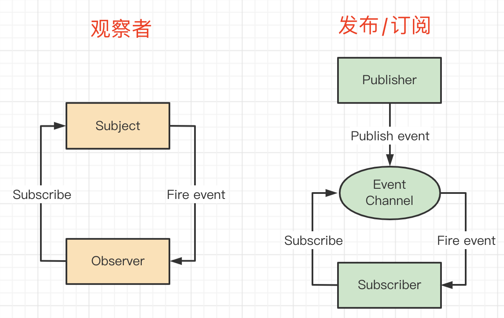
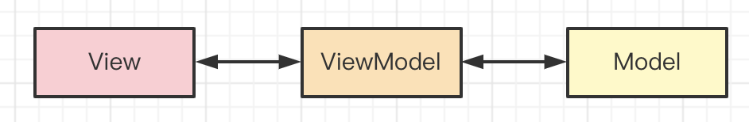

# 设计模式

## 题目

前端常用的设计模式？什么场景？

## 开放封闭原则

设计原则是设计模式的基础，开放封闭原则是最重要的：对扩展开发，对修改封闭。

## 工厂模式

用一个工厂函数，创建一个实例，封装创建的过程。

```ts
class Foo { ... }

function factory(): Foo {
    // 封装创建过程，这其中可能有很多业务逻辑

    return new Foo(...arguments)
}
```

应用场景
- jQuery `$('div')` 创建一个 jQuery 实例
- React `createElement('div', {}, children)` 创建一个 vnode

## 单例模式

提供全局唯一的对象，无论获取多少次。

```js
class SingleTon {
    private constructor() {}
    public static getInstance(): SingleTon {
        return new SingleTon()
    }
    fn1() {}
    fn2() {}
}

// const s1 = new SingleTon() // Error: constructor of 'singleton' is private

const s2 = SingleTon.getInstance()
s2.fn1()
s2.fn2()

const s3 = SingleTon.getInstance()
s2 === s3 // true
```

应用场景
- Vuex Redux 的 store ，全局唯一的
- 全局唯一的 dialog modal

PS：JS 是单线程语言。如果是 Java 等多线程语言，创建单例时还需要考虑线程锁死，否则两个线程同时创建，则可能出现两份 instance 。

## 代理模式

使用者不能直接访问真实数据，而是通过一个代理层来访问。<br>
ES Proxy 本身就是代理模式，Vue3 基于它来实现响应式。

代码参考 proxy.html 

## 观察者模式

即常说的绑定事件。一个主题，一个观察者，主题变化之后触发观察者执行。

```js
// 一个主题，一个观察者，主题变化之后触发观察者执行
btn.addEventListener('click', () => { ... })
```

## 发布订阅模式

即常说的自定义事件，一个 `event` 对象，可以绑定事件，可以触发事件。

```js
// 绑定
event.on('event-key', () => {
    // 事件1
})
event.on('event-key', () => {
    // 事件2
})

// 触发执行
event.emit('event-key')
```

温故知新。在讲 JS 内存泄漏时提到，Vue React 组件销毁时，要记得解绑自定义事件。

```js
function fn1() { /* 事件1 */ }
function fn2() { /* 事件2 */ }

// mounted 时绑定
event.on('event-key', fn1)
event.on('event-key', fn2)

// beforeUnmount 时解绑
event.off('event-key', fn1)
event.off('event-key', fn2)
```

## 装饰器模式

ES 和 TS 的 Decorator 语法就是装饰器模式。可以为 class 和 method 增加新的功能。<br>
以下代码可以在 [ts playground](https://www.typescriptlang.org/play) 中运行。

```js
// class 装饰器
function logDec(target) {
    target.flag = true
}

@logDec
class Log {
    // ...
}

console.log(Log.flag) // true
```

```js
// method 装饰器
// 每次 buy 都要发送统计日志，可以抽离到一个 decorator 中
function log(target, name, descriptor) {
    // console.log(descriptor.value) // buy 函数
    const oldValue = descriptor.value // 暂存 buy 函数

    // “装饰” buy 函数
    descriptor.value = function(param) {
        console.log(`Calling ${name} with`, param) // 打印日志
        return oldValue.call(this, param) // 执行原来的 buy 函数
    };

    return descriptor
}
class Seller {
    @log
    public buy(num) {
        console.log('do buy', num)
    }
}

const s = new Seller()
s.buy(100)
```

Angular nest.js 都已广泛使用装饰器。这种编程模式叫做**AOP 面向切面编程**：关注业务逻辑，抽离工具功能。

```js
import { Controller, Get, Post } from '@nestjs/common';

@Controller('cats')
export class CatsController {
  @Post()
  create(): string {
    return 'This action adds a new cat';
  }

  @Get()
  findAll(): string {
    return 'This action returns all cats';
  }
}
```

## 答案

传统的经典设计模式有 23 个，作为面试题只说出几个前端常用的就可以。
- 工厂模式
- 单例模式
- 代理模式
- 观察者模式
- 发布订阅模式
- 装饰器模式

## 连环问：观察者模式和发布订阅模式的区别？



观察者模式
- Subject 和 Observer 直接绑定，中间无媒介
- 如 `addEventListener` 绑定事件

发布订阅模式
- Publisher 和 Observer 相互不认识，中间有媒介
- 如 `eventBus` 自定义事件

## 连环问：MVC 和 MVVM 有什么区别

MVC 原理
- View 传送指令到 Controller
- Controller 完成业务逻辑后，要求 Model 改变状态
- Model 将新的数据发送到 View，用户得到反馈


MVVM 直接对标 Vue 即可
- View 即 Vue template
- Model 即 Vue data
- VM 即 Vue 其他核心功能，负责 View 和 Model 通讯




