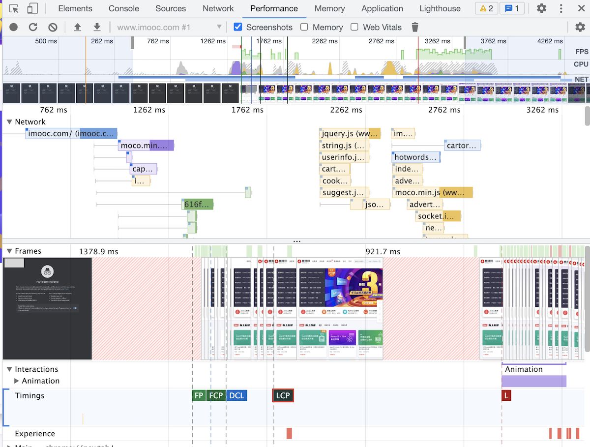
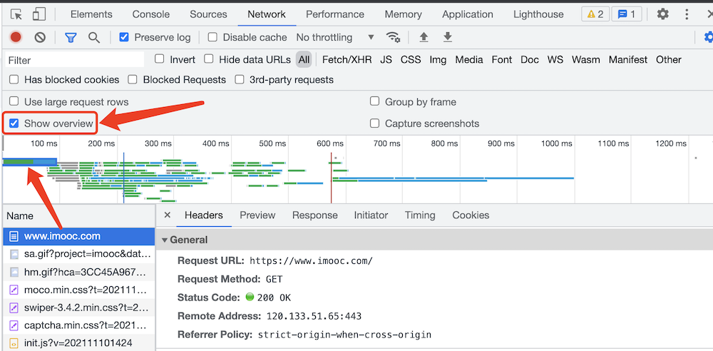
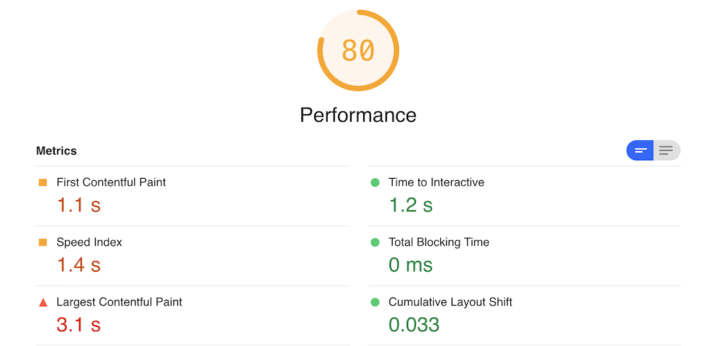
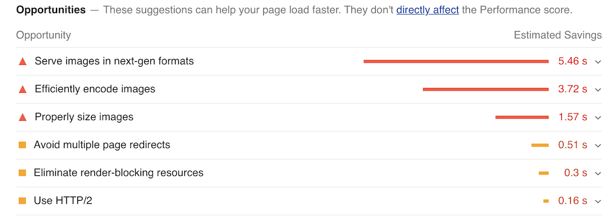
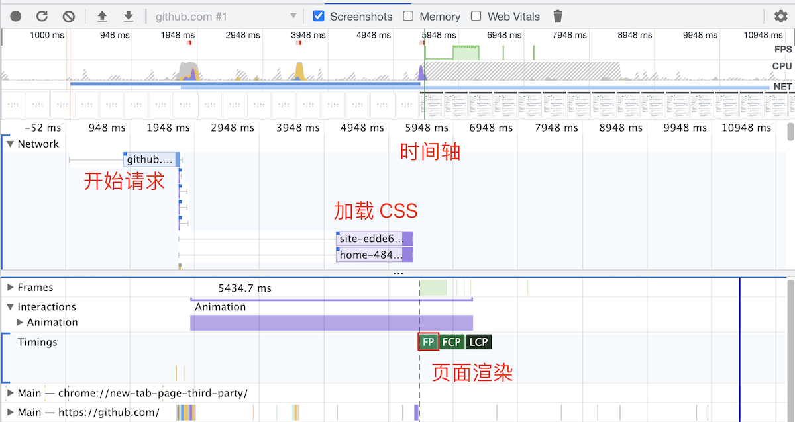

# 排查性能问题

## 题目

如果一个 h5 很慢，你该如何排查问题？

## 分析

注意审题，看面试官问的是哪方面的慢。如果他没有说清楚，你可以继续追问一下。
- 加载速度慢。则考虑网页文件、数据请求的优化，即本文所讲
- 运行卡顿，体验不流畅。则考虑内存泄漏、节流防抖、重绘重排的方面，此前面试题已经讲过

## 前端性能指标

能搜索到的性能指标非常多，也有很多非标准的指标。最常用的指标有如下几个：

### First Paint (FP)
从开始加载到浏览器**首次绘制像素**到屏幕上的时间，也就是页面在屏幕上首次发生视觉变化的时间。但此变化可能是简单的背景色更新或不引人注意的内容，它并不表示页面内容完整性，可能会报告没有任何可见的内容被绘制的时间。

### First Contentful Paint（FCP）
浏览器**首次绘制来自 DOM 的内容**的时间，内容必须是文本、图片（包含背景图）、非白色的 canvas 或 SVG，也包括带有正在加载中的 Web 字体的文本。

### First Meaningful Paint（FMP）
页面的**主要内容**绘制到屏幕上的时间。这是一个更好的衡量用户感知加载体验的指标，但无法统一衡量，因为每个页面的主要内容都不太一致。<br>
主流的分析工具都已弃用 FMP 而使用 LCP

### DomContentLoaded（DCL）
即 `DOMContentLoaded` 触发时间，DOM 全部解析并渲染完。

### Largest Contentful Paint（LCP） 
**可视区域中最大的内容元素**呈现到屏幕上的时间，用以估算页面的主要内容对用户可见时间。

### Load（L）
即 `window.onload` 触发时间，页面内容（包括图片）全部加载完成。

## 性能分析工具 - Chrome devtools

PS：建议在 Chrome 隐身模式测试，避免其他缓存的干扰。

Performance 可以检测到上述的性能指标，并且有网页快照截图。




NetWork 可以看到各个资源的加载时间




## 性能分析工具 - Lighthouse

[Lighthouse](https://www.npmjs.com/package/lighthouse) 是非常优秀的第三方性能评测工具，支持移动端和 PC 端。
它支持 Chrome 插件和 npm 安装，国内情况推荐使用后者。

```sh
# 安装
npm i lighthouse -g

# 检测一个网页，检测完毕之后会打开一个报告网页
lighthouse https://imooc.com/ --view --preset=desktop # 或者 mobile
```

测试完成之后，lighthouse 给出测试报告



并且会给出一些优化建议



## 识别问题

网页慢，到底是加载慢，还是渲染慢？—— 分清楚很重要，因为前后端不同负责。

如下图是 github 的性能分析，很明显这是加载慢，渲染很快。



## 解决方案

加载慢
- 优化服务端接口
- 使用 CDN
- 压缩文件
- 拆包，异步加载

渲染慢（可参考“首屏优化”）
- 根据业务功能，继续打点监控
- 如果是 SPA 异步加载资源，需要特别关注网络请求的时间

## 持续跟进

分析、解决、测试，都是在你本地进行，网站其他用户的情况你看不到。
所以要增加性能统计，看全局，不只看自己。

JS 中有 Performance API 可供获取网页的各项性能数据，对于性能统计非常重要。
如 `performance.timing` 可以获取网页加载各个阶段的时间戳。

如果你的公司没有内部的统计服务（一般只有大厂有），没必要自研，成本太高了。可以使用第三方的统计服务，例如阿里云 ARMS 。

## 答案

- 通过工具分析性能参数
- 识别问题：加载慢？渲染慢？
- 解决问题
- 增加性能统计，持续跟进、优化
