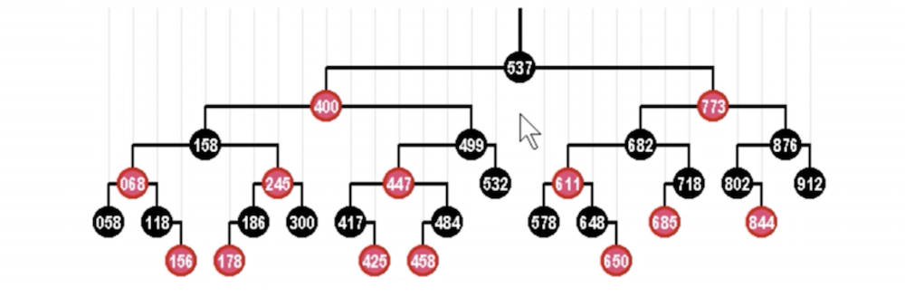
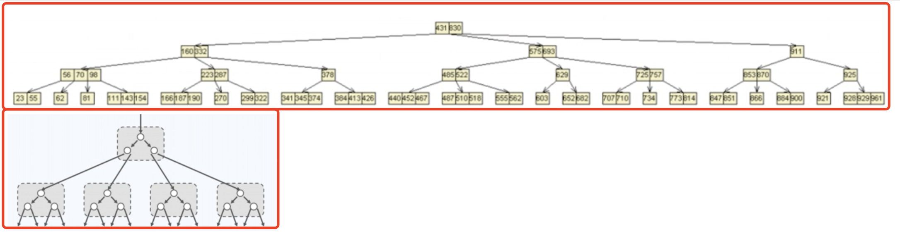
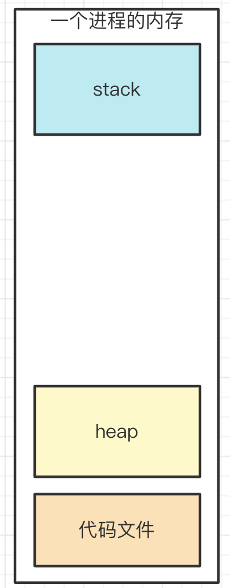
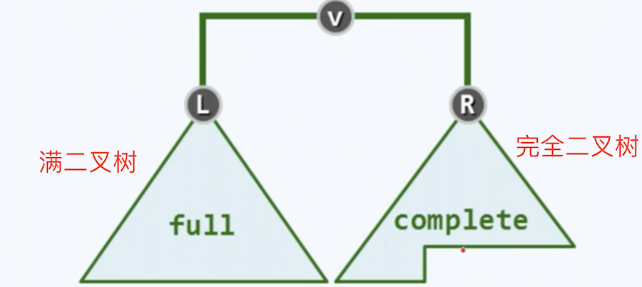
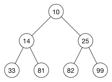

# 为何二叉树重要

## 题目

为何二叉树那么重要，而不是三叉树、四叉树呢？

## 分析

树是常见的数据结构，如 DOM 树，是一种多叉树。<br>
其中二叉树是一个特别的存在，很重要，很常考。

【注意】本文涉及很多数据结构的知识，所以要“不求甚解” —— 掌握要点和结果，不求细节和过程

## 如何让性能整体最优？

有序结构
- 数组：查找易，增删难
- 链表：增删易，查找难

将两者优点结合起来 —— 二叉搜索树 BST ：查找易，增删易 —— 可使用二分算法

二叉搜索树 BST
- 左节点（包括其后代） <= 根节点
- 右节点（包括其后代） >= 根节点 


## 高级二叉树

二叉搜索树 BST ，如果左右不平衡，也无法做到最优。<br>
极端情况下，它就成了链表 —— 这不是我们想要的。

平衡二叉搜索树 BBST ：要求树左右尽量平衡
- 树高度 `h` 约等于 `logn`
- 查找、增删，时间复杂度都等于 `O(logn)`

红黑树：一种自动平衡的二叉树
- 节点分 红/黑 两种颜色，通过颜色转换来维持树的平衡
- 相比于普通平衡二叉树，它维持平衡的效率更高



B 树：物理上是多叉树，但逻辑上是一个 BST 。用于高效 I/O ，如关系型数据库就用 B 树来组织数据结构。



## 堆

JS 执行时代码中的变量
- 值类型 - 存储到栈
- 引用类型 - 存储到堆



堆的特点：
- 节点的值，总是不大于（或不小于）其父节点的值
- 完全二叉树



堆，虽然逻辑上是二叉树，但实际上它使用数组来存储的。



```js
// 上图是一个堆（从小到大），可以用数组表示
const heap = [-1, 10, 14, 25, 33, 81, 82, 99] // 忽略 0 节点

// 节点关系
const parentIndex = Math.floor(i / 2)
const leftIndex = 2 * i
const rightIndex = 2 * i + 1
```

堆的排序规则，没有 BST 那么严格，这就造成了
- 查询比 BST 慢
- 增删比 BST 快，维持平衡也更快
- 但整体复杂度都是 `O(logn)` 级别，即树的高度

但结合堆的应用场景
- 一般使用内存地址（栈中保存了）来查询，不会直接从根节点搜索
- 堆的物理结构是数组，所以查询复杂度就是 `O(1)`

总结
- 物理结构是数组（空间更小），逻辑结构是二叉树（操作更快）
- 适用于“堆栈”结构

## 答案

- 二叉树，可以充分利用二分法
- 二叉树可以同时规避数字和链表的缺点
- 引申到 BST BBST 等其他扩展结构

## 划重点

- 二分法的神奇力量
- 各个高级数据结构的存在价值、设计初衷
- 数据结构是基本功能
