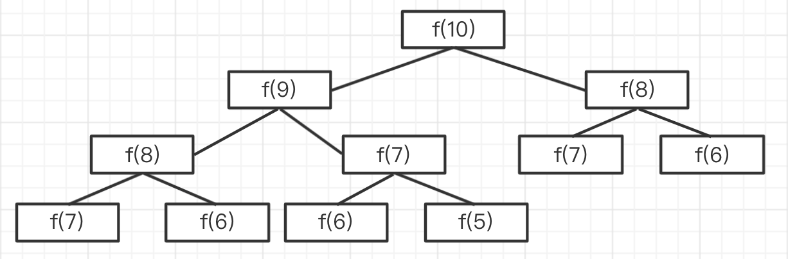

# 斐波那契数列

## 题目

用 Javascript 计算第 n 个斐波那契数列的值，注意时间复杂度。

## 分析

斐波那契数列很好理解
- `f(0) = 0`
- `f(1) = 1`
- `f(n) = f(n - 1) + f(n - 2)` 前两个值的和

## 递归计算

但这种方式会导致很多重复计算。 
时间复杂度是 `O(2^n)` ，爆炸式增长，不可用。（可以试试 `n: 100` ，程序会卡死）

## 优化

不用递归，用循环，记录中间结果。时间复杂度降低到 `O(n)`

## 动态规划

即，把一个大问题，拆解为不同的小问题，递归向下。

【注意】一般使用动态规划的思路（递归）分析问题，再转换为循环来解决问题。

## 三大算法思维

- 贪心（递归）
- 二分
- 动态规划

## 答案

使用循环的方式，参考 fibonacci.ts

## 划重点

- 动态规划的思路
- 识别出时间复杂度

## 扩展

青蛙跳台阶：一只青蛙，一次可以跳 1 个台阶，也可以跳 2 个台阶，问该青蛙跳上 n 级台阶，总共有多少种方式？

分析
- `f(1) = 1` 跳 1 级台阶，只有一种方式
- `f(2) = 2` 跳 2 级台阶，有两种方式
- `f(n) = f(n - 1) + fn(n - 2)` 跳 n 级，可拆分为两个问题
    - 第一次跳，要么 1 级，要么 2 级，只有这两种
    - 第一次跳 1 级，剩下有 `f(n - 1)` 种方式
    - 第一次跳 2 级，剩下有 `f(n - 2)` 种方式

看公式，和斐波那契数列一样。
