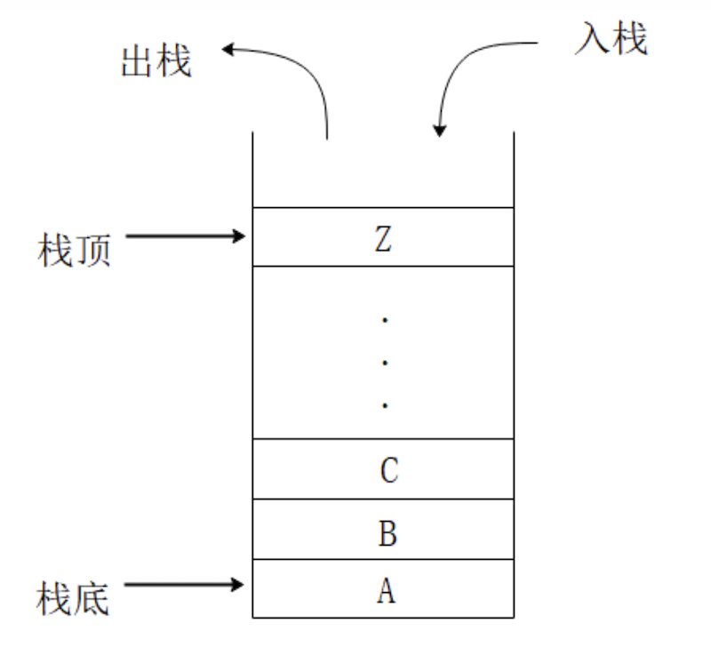
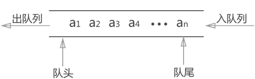
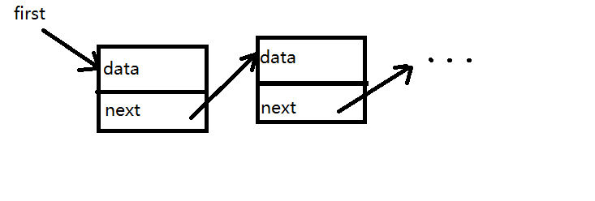
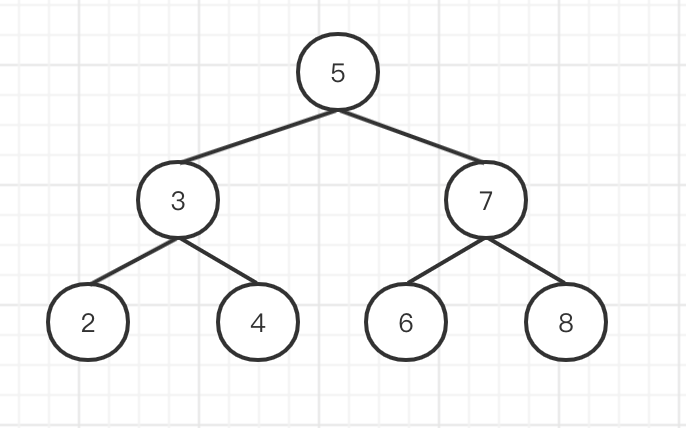

# 常见数据结构

前端开发中常见的数据结构

## 栈 Stack

栈 Stack 是一种“先进后出”的数据结构。



```js
// 数组实现 栈
const stack = []
stack.push(100) // 压栈
stack.pop() // 出栈
```

## 队列 Queue

队列 Queue 是一种“先进先出”的数据结构。



```js
// 数组实现 队列
const queue = []
queue.push(100) // 入队
queue.shift() // 出队
```

## 链表 Linked list

链表不是连续的数据结构，而是由一系列的节点组成，节点之间通过指针连接。



```ts
// 链表节点的数据结构
interface IListNode {
    data: any
    next: IListNode | null
}
```

## 树 Tree

树，是一种有序的层级结构。每个节点下面可以有若干个子节点。例如常见的 DOM 树。


```ts
// 树节点的数据结构
interface ITreeNode {
    data: any
    children: ITreeNode[] | null
}
```

## 二叉树 Binary Tree

二叉树，首先它是一棵树，其次它的每个节点，最多有两个子节点，分别为 `left` 和 `right`



```ts
// 二叉树节点的数据结构
interface IBinaryTreeNode {
    data: any
    left: IBinaryTreeNode | null
    right: IBinaryTreeNode | null
}
```
