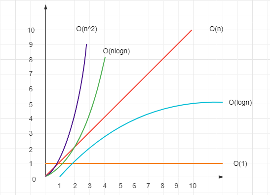

# 算法时间复杂度

本文总结一下前端算法常用的时间复杂度，对比学习。

## O(1)

代码就是平铺直叙的执行，没有任何循环。

## O(logn)

有循环，但其中使用了二分法，例如：二分查找算法

二分法是非常重要的算法思维，它可以极大的减少复杂度，而且计算量越大、减少的越明显。可以看看本文上面的图。

## O(n)

普通的循环。

## O(n*logn)

嵌套循环，一层是普通循环，一层有二分算法。例如：快速排序算法。

## O(n^2)

两个普通循环的嵌套，例如常见的冒泡排序。
