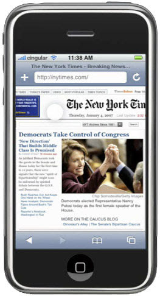

# 移动端 click 300ms 延迟

## 题目

移动端 click 300ms 延迟，如何解决

## 背景

智能手机开始流行的前期，浏览器可以点击缩放（double tap to zoom）网页。这样在手机上就可以浏览 PC 网页，很酷炫。



浏览器为了分辨 click 还是“点击缩放”，就强行把 click 时间延迟 300ms 触发。

## 初期解决方案

[FastClick](https://www.npmjs.com/package/fastclick) 专门用于解决这个问题。

```js
// FastClick 使用非常简单
window.addEventListener( "load", function() {
    FastClick.attach( document.body )
}, false )
```

它的内部原理是
- 监听 `touchend` 事件 （`touchstart` `touchend` 会先于 `click` 事件被触发）
- 通过 [DOM 自定义事件](https://developer.mozilla.org/zh-CN/docs/Web/API/CustomEvent) 模拟一个 click 事件
- 把 300ms 之后触发的 click 事件阻止掉

## 现代浏览器的改进

随着近几年移动端响应式的大力发展，移动端网页和 PC 网页有不同的设计，不用再缩放查看。<br>
这 300ms 的延迟就多余了，现代浏览器可以通过禁止缩放来取消这 300ms 的延迟。

- Chrome 32+ on Android
- iOS 9.3

```html
<meta name="viewport" content="width=device-width" />
```

## 答案

- 原因：点击缩放（double tap to zoom）网页
- 可使用 FastClick 解决
- 现代浏览器可使用 `width=device-width` 规避
