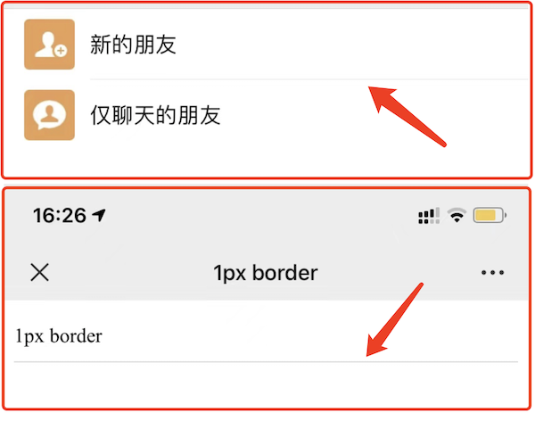
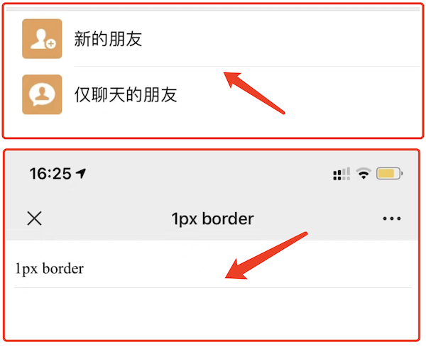

# 1px 宽度

注：文本小节

## 题目

Retina 屏 1px 像素问题，如何实现

## 介绍

该问题通常用于考察你是否做过移动端 h5 项目。<br>
如果你能知道这个问题，并且答出来，知道前因后果，证明你有过 h5 开发经验。<br>
否则就说明你没有 h5 的任何开发经验，尤其是你如果都不知道这个事情，那就更加说明这一点。

## 普通的 `1px`

如果仅仅使用 css 的 `1px` 来设置 border ，那可能会出现比较粗的情况。<br>
因为，有些手机屏幕的 DPR = 2 ，即 `1px` 它会用两个物理像素来显示，就粗了。

```css
#box {
    padding: 10px 0;
    border-bottom: 1px solid #eee;
}
```

如下图，上面是微信 app 的 border ，下面是 `1px` 的 border ，有明显的区别。显得很粗糙，很不精致，设计师不会允许这样的页面发布上线的。



PS：你不能直接写 `0.5px` ，浏览器兼容性不好，渲染出来可能还是 `1px` 的效果。

## 使用 `transform` 缩小

我们可以使用 css 伪类 + `transform` 来优化这一问题。即把默认的 `1px` 宽度给压缩 0.5 倍。

```css
#box {
    padding: 10px 0;
    position: relative;
}
#box::before {
    content: '';
    position: absolute;
    left: 0;
    bottom: 0;
    width: 100%;
    height: 1px;
    background: #d9d9d9;
    transform: scaleY(0.5);
    transform-origin: 0 0;
}
```

如下图，上面是微信 app 的 border ，下面是优化之后的 border ，两者粗细就一致了。



## 连环问：如果有 `border-radius` 怎么办

可以使用 `box-shadow` 设置
- X 偏移量 `0`
- Y 偏移量 `0`
- 阴影模糊半径 `0`
- 阴影扩散半径 `0.5px`
- 阴影颜色

```css
#box2 {
    margin-top: 20px;
    padding: 10px;
    border-radius: 5px;
    /* border: 1px solid #d9d9d9; */
    box-shadow: 0 0 0 0.5px #d9d9d9;
}
```
