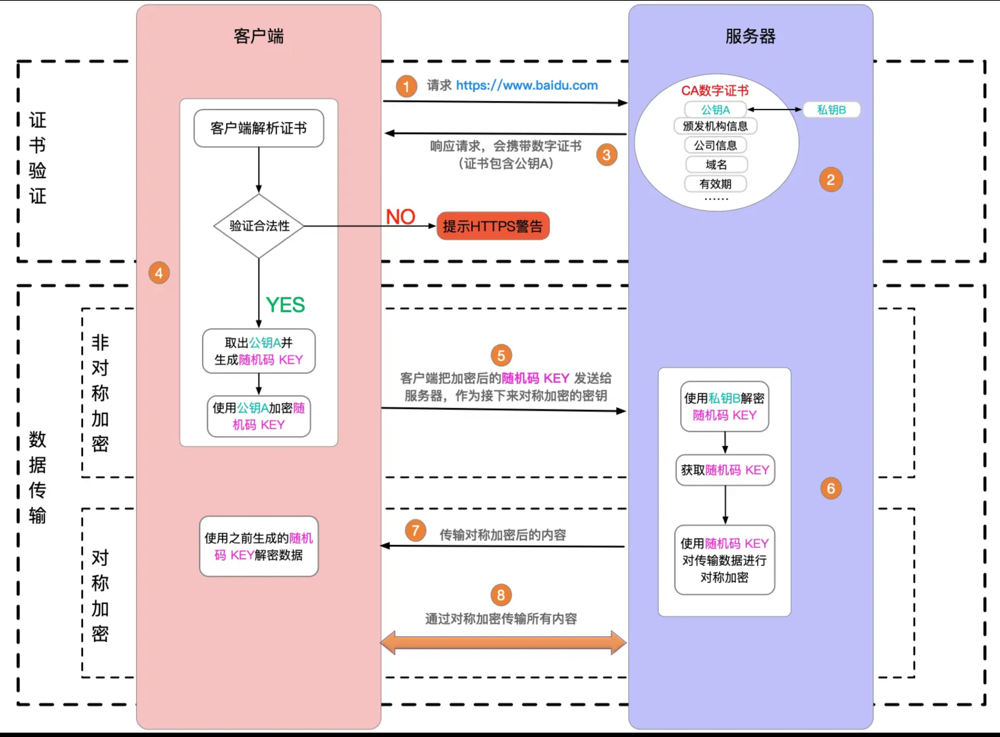
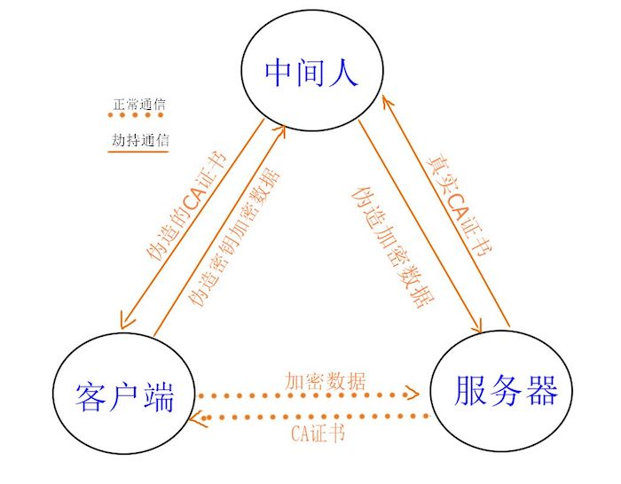
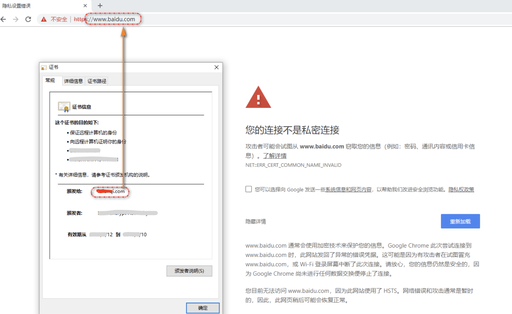

# https 中间人攻击

## 题目

什么是 https 中间人攻击，如何预防？

## 复习：https 加密原理

http 是明文传输，传输的所有内容（如登录的用户名和密码），都会被中间的代理商（无论合法还是非法）获取到。

http + TLS/SSL = https ，即加密传输信息。只有客户端和服务端可以解密为明文，中间的过程无法解密。

## 中间人攻击

中间人攻击，就是黑客劫持网络请求，伪造 CA 证书。

解决方案：使用浏览器可识别的，正规厂商的证书（如阿里云），慎用免费证书。

