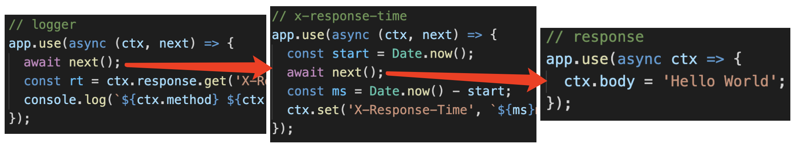

# koa2 洋葱圈模型

## 题目

请描述 Koa2 的洋葱圈模型

## 解释

代码参考 Koa2 官网

```js
const Koa = require('koa');
const app = new Koa();

// logger
app.use(async (ctx, next) => {
  await next();
  const rt = ctx.response.get('X-Response-Time');
  console.log(`${ctx.method} ${ctx.url} - ${rt}`);
});

// x-response-time
app.use(async (ctx, next) => {
  const start = Date.now();
  await next();
  const ms = Date.now() - start;
  ctx.set('X-Response-Time', `${ms}ms`);
});

// response
app.use(async ctx => {
  ctx.body = 'Hello World';
});

app.listen(3000);
```

## 图示




