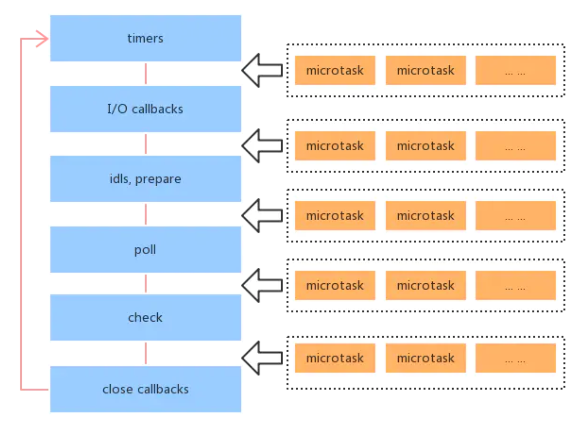

# 浏览器和 nodejs 事件循环的区别

## 题目

浏览器和 nodejs 事件循环的区别

## 单线程和异步

JS 是单线程的，浏览器中 JS 和 DOM 渲染线程互斥。<br>
单线程，代码就必须“串行”执行，无法并行，同一时间只能干一件事。

在 Java 等多线程语言中，发起请求、设置定时任务可以通过新开一个线程来处理，这就是并行。<br>
而 JS 是单线程，这种场景就只能使用“异步”。

```js
console.log('start')
setTimeout(() => {
    console.log('hello')
})
console.log('end')
```

## 宏任务和微任务

浏览器端异步的 API 有很多
- 宏任务：setTimeout 网络请求
- 微任务：promise

两者表面的区别：

第一，微任务比宏任务更快执行

```js
console.log('start')
setTimeout(() => {
    console.log('timeout')
})
Promise.resolve().then(() => {
    console.log('promise.then')
})
console.log('end')
```

第二，微任务在 DOM 渲染前执行，而宏任务在 DOM 显示后（即真正显示到页面上，肉眼可见）执行

```js
const p = document.createElement('p')
p.innerHTML = 'new paragraph'
document.body.appendChild(p)
console.log('length----', list.length)

console.log('start')
setTimeout(() => {
    const list = document.getElementsByTagName('p')
    console.log('timeout----', list.length)
    alert('阻塞')
})
Promise.resolve().then(() => {
    const list = document.getElementsByTagName('p')
    console.log('promise.then----', list.length)
    alert('阻塞')
})
console.log('end')
```

## 浏览器的事件循环

主要的流程
- 执行 JS 同步代码（执行异步 API 时，异步先放在一个队列中，先不执行）
- DOM 渲染
- 执行队列中的异步函数（执行异步 API 时，异步先放在一个队列中，先不执行）—— 异步中可能还嵌套异步
- DOM 渲染
- 执行队列中的异步函数（执行异步 API 时，异步先放在一个队列中，先不执行）
- DOM 渲染
- ...


考虑宏任务和微任务
- 执行 JS 同步代码（异步函数，分别放在 macroTaskQueue 和 microTaskQueue ）
- DOM 结构渲染（此时还没有在页面显示，但可以获取 DOM 内容了）
- 执行 microTaskQueue 函数（异步中还可能嵌套异步...）
- 显示 DOM 到页面
- 执行 macroTaskQueue 函数（异步中还可能嵌套异步...）
- ...

## nodejs 异步

nodejs 也是用了 V8 引擎和 ES 语法，所以也有同步、异步，异步也分宏任务、微任务。

- setTimeout setInterval —— 宏任务
- promise 和 async/await  —— 微任务
- process.nextTick —— 微任务，**但优先级最高**
- setImmediate —— 宏任务
- I/O 文件、网络 —— 宏任务
- Socket 连接：连接 mysql —— 宏任务

```js
console.log('start')
setImmediate(() => {
    console.log('immediate1')
})
setTimeout(() => {
    console.log('timeout1')
})
Promise.resolve().then(() => {
    console.log('promise then')
})
process.nextTick(() => {
    console.log('nextTick')
})
console.log('end')
```

## nodejs 事件循环

浏览器的各种宏任务，都是按照代码的顺序执行的，没有其他优先级。

nodejs 的宏任务是分了如下类型，nodejs 事件循环中宏任务需要按照这个顺序来执行。

- timers(计时器) - 执行 `setTimeout` 以及 `setInterval` 的回调
- I/O callbacks - 处理网络、流、TCP 的错误回调
- idle, prepare --- 闲置阶段 - node 内部使用
- poll(轮循) - 执行 poll 中的 I/O 队列，检查定时器是否到时间
- check(检查) - 存放 `setImmediate` 回调
- close callbacks - 关闭回调，例如 `socket.on('close')`

nodejs 事件循环的过程
- 执行同步代码
- 执行 `process.nextTick` 和微任务（前者优先级更高）
- 按照顺序执行 6 个类型的宏任务
- ...



## 答案

- 事件循环的大概模式相同
- 宏任务有优先级区分
- `process.nextTick` 在微任务的优先级更高

但是，`process.nextTick` 在最新版 nodejs 中不被推荐使用，推荐使用 `setImmediate`
原因在于 `process.nextTick` 是在当前帧介绍后立即执行，会阻断IO并且有最大数量限制（递归时会有问题）
而 `setImmediate` 不会阻断 IO ，更像是 `setTimeout(fun, 0)`

## 注意

基于 nodejs 最新版。nodejs 旧版会有所不同，特别注意。
