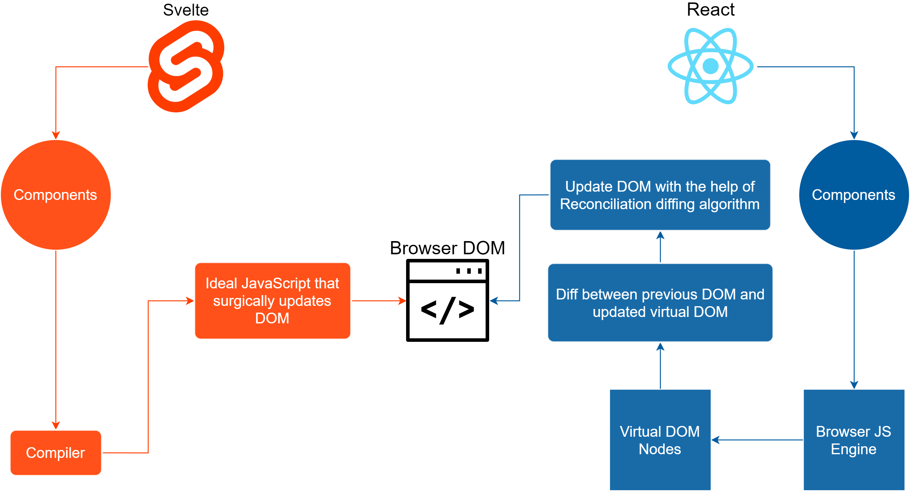

# vdom 真的很快吗

## 题目

vdom 真的很快吗？

## Vue React 等框架的存在价值

Vue React 等框架给前端开发带来了革命性的变化。相比于此前的 jQuery 时代，它们的价值在于
- 组件化 —— 这不是核心原因。WebComponent 已提出多年，当仍未发展壮大
- 数据视图分离，数据驱动视图 —— 这才是核心！！！

数据视图分离，开发时只需要关注业务数据（React 的 state，Vue 的 data）即可，不用在实时的修改 DOM —— 这一点和 jQuery 有了本质区别。<br>
特别是对于大型的前端项目，将极大的降低开发复杂度，提高稳定性。

数据驱动视图，内部将如何实现呢？—— 借助于 vdom

## vdom

Virtual DOM，虚拟 DOM ，即用 JS 对象模拟 DOM 数据。是 React 最先提出来的概念。

React 的 JSX ，Vue 的 template 其实都是语法糖，它们本质上都是一个函数，成为 `render 函数`

```ts
// JSX: <p id="p1">hello world</p>
function render(): VNode {
    return createElement('p', { id: 'p1' }, ['hello world'])
}
```

执行 render 函数返回的就是一个 vdom 对象，一般叫做 vnode（虚拟节点），对应 DOM Node

每次数据更新（如 React setState）render 函数都会生成 newVnode ，然后前后对比 `diff(vnode, newVnode)`，计算出需要修改的 DOM 节点，再做修改。

## 对比 DOM 操作

下面两者，哪个更快？—— 很明显，前者更快。
- jquery 时代：直接修改 DOM
- 框架时代：生成 vdom ，进行 diff 运算 --> 修改 DOM

但凡事都要有一个业务背景。如果页面功能越来越复杂，直接操作 DOM 代码将会难以阅读和维护，大家更希望要“数据视图分离，数据驱动视图”。

在这个前提下，哪个更快？ —— 当然是后者。因为业务复杂、代码混乱，将会导致很多无谓的 DOM 操作 —— **DOM 操作是昂贵的**
- 直接修改 DOM
- 生成 vdom ，进行 diff 运算 --> 修改 DOM

而相比于昂贵的 DOM 操作，JS 运算非常快。所以 JS 多做事情（vdom diff）是更优的选择。

## 答案

- 直接进行 DOM 操作永远都是最快的（但要目标明确，不能有无谓的 DOM 操作 —— 这很难）
- 如果业务复杂，要“数据视图分离，数据驱动视图”，无法直接修改 DOM ，那 vdom 就是一个很好的选择

所以，**vdom 并不比 DOM 操作更快**（反而更慢，它做了 JS 运算），它只是在某个特定的场景下，无法做到精准 DOM 修改时，一个更优的选择。

## 扩展

[Svelte](https://www.sveltejs.cn/) 不使用 vdom ，它将组件修改，编译为精准的 DOM 操作。和 React 设计思路完全不一样。


