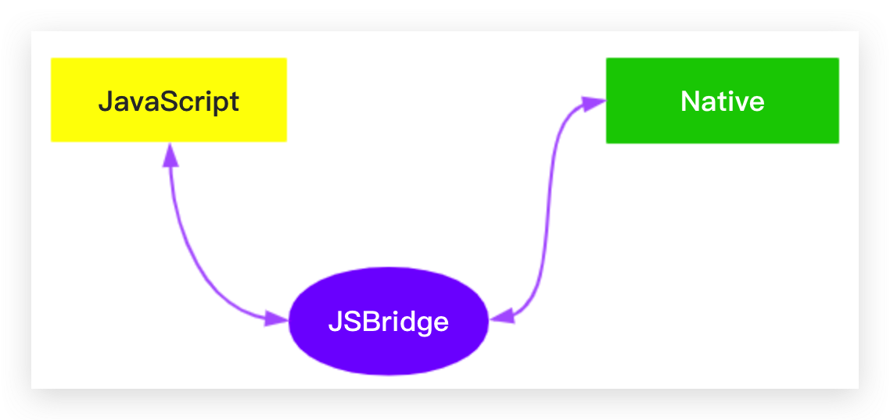

# js-bridge 原理

## 题目

请描述 js-bridge 原理

## 微信 jssdk

微信中的 h5 通过 [jssdk](https://developers.weixin.qq.com/doc/offiaccount/OA_Web_Apps/JS-SDK.html) 提供的 API 可以调用微信 app 的某些功能。

JS 无法直接调用 app 的 API ，需要通过一种方式 —— 通称 js-bridge ，它也是一些 JS 代码。<br>
当然，前提是 app 得开发支持，控制权在 app 端。就像跨域，server 不开放支持，客户端再折腾也没用。



## 方式1 - 注入 API

客户端为 webview 做定制开发，在 window 增加一些 API ，共前端调用。

例如增加一个 `window.getVersion` API ，前端 JS 即可调用它来获取 app 版本号。

```js
const v = window.getVersion()
```

但这种方式一般都是**同步**的。<br>
因为你即便你传入了一个 callback 函数，app 也无法执行。app 只能执行一段全局的 JS 代码（像 `eval`）

## 方式2 - 劫持 url scheme

一个 iframe 请求 url ，返回的是一个网页。天然支持异步。

```js
const iframe1 = document.getElementById('iframe1')
iframe1.onload = () => {
    console.log(iframe1.contentWindow.document.body.innerHTML)
}
iframe1.src = 'http://127.0.0.1:8881/size-unit.html'
```

上述 url 使用的是标准的 http 协议，如果要改成 `'my-app-name://api/getVersion'` 呢？—— 默认会报错，`'my-app-name'` 是一个未识别的协议名称。<br>
既然未识别的协议，那就可以为我所用：app 监听所有的网络请求，遇到 `my-app-name:` 协议，就分析 path ，并返回响应的内容。

```js
const iframe1 = document.getElementById('iframe1')
iframe1.onload = () => {
    console.log(iframe1.contentWindow.document.body.innerHTML) // '{ version: '1.0.1' }'
}
iframe1.src = 'my-app-name://api/getVersion'
```

这种自定义协议的方式，就叫做“url scheme”。微信的 scheme 以 `'weixin://'` 开头，可搜索“微信 scheme”。

chrome 也有自己的 scheme
- `chrome://version` 查看版本信息
- `chrome://dino` 恐龙小游戏
其他可参考 https://mp.weixin.qq.com/s/T1Qkt8DTZvpsm8CKtEpNxA

## 封装 sdk

scheme 的调用方式非常复杂，不能每个 API 都写重复的代码，所以一般要封装 sdk ，就像微信提供的 jssdk 。

```js
const sdk = {
    invoke(url, data, success, err) {
        const iframe = document.createElement('iframe')
        iframe.style.display = 'none'
        document.body.appendChild(iframe)

        iframe.onload = () => {
            const content = iframe.contentWindow.document.body.innerHTML
            success(JSON.parse(content))
            iframe.remove()
        }
        iframe.onerror = () => {
            err()
            iframe.remove()
        }
        iframe.src = `my-app-name://${url}?data=${JSON.string(data)}`
    }

    fn1(data, success, err) {
        invoke('api/fn1', data, success, err)
    }

    fn2(data, success, err) {
        invoke('api/fn2', data, success, err)
    }
}

// 使用
sdk.fn1(
    {a: 10},
    (data) => { console.log('success', data) },
    () => { console.log('err') }
)
```

## 答案

常用方法：劫持 url scheme

## 扩展

url 长度不够怎么办？—— 可以扩展 ajax post 方式。
