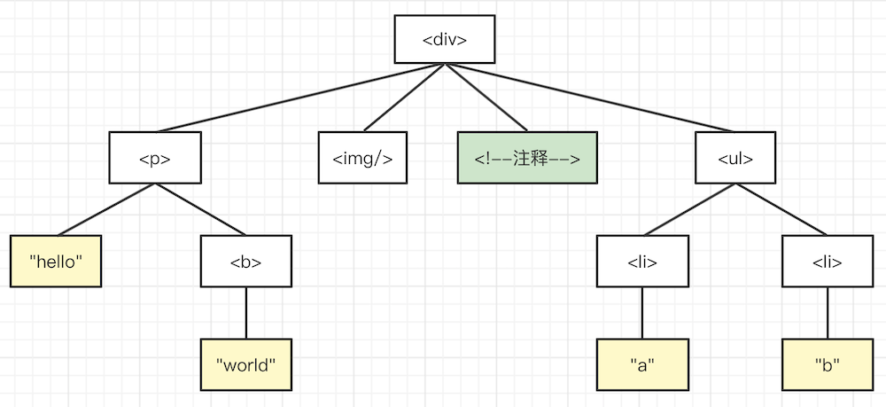

# 遍历 DOM 树

## 题目

写一个函数遍历 DOM 树，分别用深度优先和广度优先

PS：注意回顾 “Node 和 Element 和区别”

## 深度优先 vs 广度优先

深度优先的结果 `
 
 "hello" <b> "world"  注释 <ul> <li> "a" <li> "b"`

广度优先的结果 `
 
  注释 <ul> "hello" <b> <li> <li> "world" "a" "b"`

## 深度优先

一般通过递归实现，代码参考 dom-traverse.ts

## 广度优先

一般通过队列实现，代码参考 dom-traverse.ts

## 解答

- 深度优先，递归
- 广度优先，队列

## 连环问：深度优先可以不用递归吗？

深度优先遍历，可以使用栈代替递归，递归本质上就是栈。代码参考 dom-traverse.ts

递归和非递归哪个更好？
- 递归逻辑更加清晰，但容易出现 `stack overflow` 错误（可使用`尾递归`，编译器有优化）
- 非递归效率更高，但使用栈，逻辑稍微复杂一些
