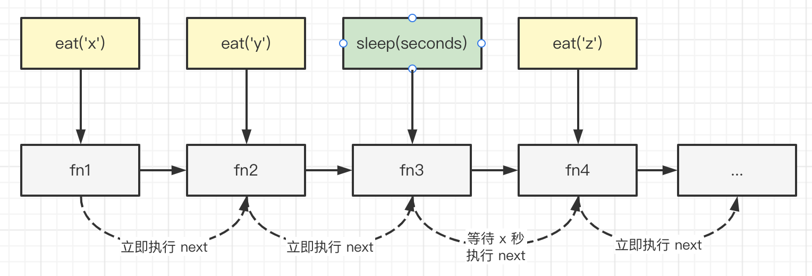

# 手写 LazyMan

## 题目

手写 LazyMan ，实现 `sleep` 和 `eat` 两个方法，支持链式调用。
代码示例：

```js
const me = new LazyMan('双越')
me.eat('苹果').eat('香蕉').sleep(5).eat('葡萄') // 打印结果如下：

// '双越 eat 苹果'
// '双越 eat 香蕉'
// （等待 5s）
// '双越 eat 葡萄'
```

## 设计 class 框架

```js
class LazyMan {
    private name: string
    constructor(name: string) {
        this.name = name
    }
    eat(x: string) {
        // 打印 eat 行为

        return this // 支持链式调用
    }
    sleep(seconds: number) {
        // 等待 10s 的处理逻辑

        return this // 支持链式调用
    }
}
```

## 处理 sleep 逻辑

初始化一个任务队列，执行 `eat` 和 `sleep` 是都往队列插入一个函数。依次执行队列的任务，遇到 `sleep` 就延迟触发 `next` 。



代码参考 lazy-man.ts

## 总结

- 链式调用
- 任务队列
- 延迟触发
