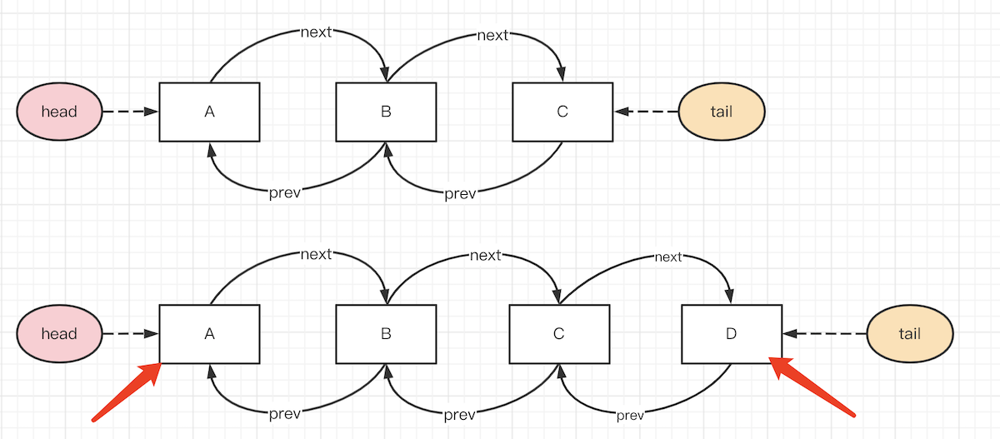
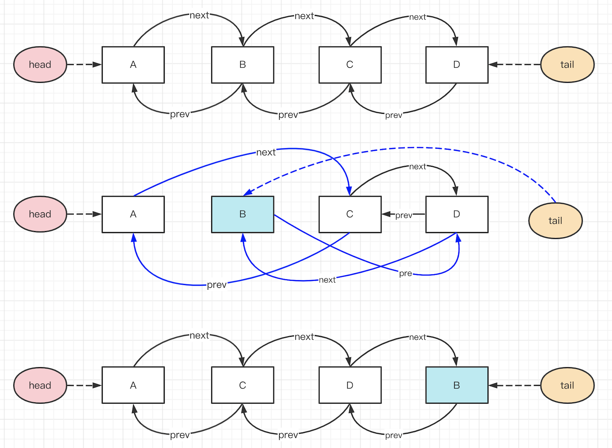

# 手写 LRU

## 题目

用 JS 实现一个 LRU 缓存

## LRU 使用

Least Recently Used 最近最少使用<br>
即淘汰掉最近最少使用的数据，只保留最近经常使用的资源。它是一个固定容量的缓存容器。

```js
const lruCache = new LRUCache(2); // 最大缓存长度 2
lruCache.set(1, 1); // 缓存是 {1=1}
lruCache.set(2, 2); // 缓存是 {1=1, 2=2}
lruCache.get(1);    // 返回 1
lruCache.set(3, 3); // 该操作会使得关键字 2 作废，缓存是 {1=1, 3=3}
lruCache.get(2);    // 返回 null
lruCache.set(4, 4); // 该操作会使得关键字 1 作废，缓存是 {4=4, 3=3}
lruCache.get(1);    // 返回 null
lruCache.get(3);    // 返回 3
lruCache.get(4);    // 返回 4
```

## 分析

- 哈希表，即 `{ k1: v1, k2: v2, ... }` 形式。可以 `O(1)` 事件复杂度存取 `key` `value`
- 有序。可以根据最近使用情况清理缓存

JS 内置的数据结构类型 `Object` `Array` `Set` `Map` ，恰好 `Map` 符合这两条要求

## Map 是有序的

Map 有序，Object 无序

## 实现

代码参考 LRU.ts

注意，`get` `set` 时都要把操作数据移动到 Map 最新的位置。

## 扩展

实际项目中可以使用第三方 lib
- https://www.npmjs.com/package/quick-lru
- https://www.npmjs.com/package/lru-cache
- https://www.npmjs.com/package/tiny-lru
- https://www.npmjs.com/package/mnemonist

## 连环问：不用 Map 如何实现 LRU cache ？

LRU cache 是很早就有的算法，而 Map 仅仅是这几年才加入的 ES 语法。

### 使用 Object 和 Array

根据上文的分析，两个条件
- 哈希表，可以用 `Object` 实现
- 有序，可以用 `Array` 实现

```js
// 执行 lru.set('a', 1) lru.set('b', 2) lru.set('c', 3) 后的数据

const obj1 = { value: 1, key: 'a' }
const obj2 = { value: 2, key: 'b' }
const obj3 = { value: 3, key: 'c' }

const data = [obj1, obj2, obj3]
const map = { 'a': obj1, 'b': obj2, 'c': obj3 }
```

模拟 `get` `set` 操作，会发现几个问题，都来自于数组
- 超出 cache 容量时，要移除最早的元素，数组 `shift` 效率低
- 每次 `get` `set` 时都要把当前元素移动到最新的位置，数组 `splice` 效率低

### Array 改为双向链表

数组有问题，就需要使用新的数据结构 **双向链表**

```ts
Interface INode {
    value: any
    next?: INode
    prev?: INode
}
```

双向链表可以快速移动元素。末尾新增元素 D 很简单，开头删除 A 元素也很简单。



要把中间的元素 B 移动到最后（如 LRU `set` `get` 时移动数据位置），只需要修改前后的指针即可，效率很高。



### 实现

代码参考 LRU2.ts

注意事项
- 数据结构如何定义，`data` 和链表分别存储什么
- 双向链表的操作（非常繁琐，写代码很容易出错，逻辑一定要清晰！！！）
- 链表 `node` 中要存储 `data.key` ，否则删除 `data` 需要遍历、效率低
