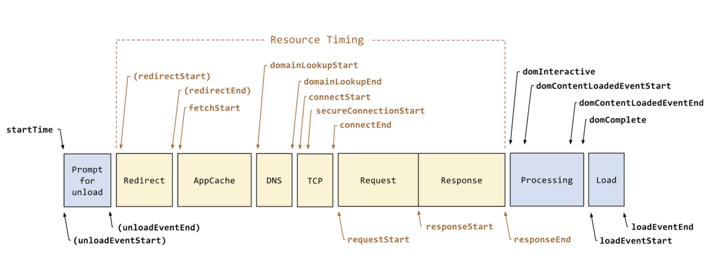
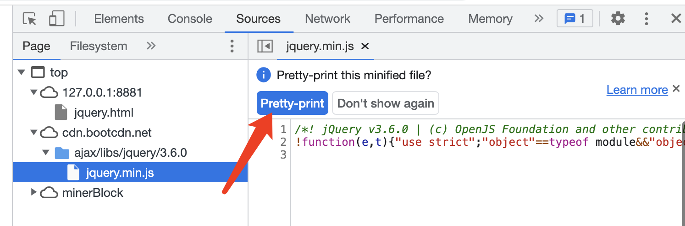

# 前端统计 sdk

## 题目

要让你设计一个前端统计 SDK ，你会如何设计？

## 分析

前端统计的范围
- 访问量 PV
- 自定义事件（如统计一个按钮被点击了多少次）
- 性能
- 错误

统计数据的流程 （只做前端 SDK ，但是要了解全局）
- 前端发送统计数据给服务端
- 服务端接受，并处理统计数据
- 查看统计结果

## 代码结构

SDK 要用于多个不同的产品，所以初始化要传入 `productId`

```js
class MyStatistic {
    private productId: number

    constructor(productId: number = 0) {
        if (productId <= 0) {
            throw new Error('productId is invalid')
        }
        this.productId = productId // 产品 id （SDK 会被用于多个产品）

        this.initPerformance() // 性能统计
        this.initError() // 监听错误
    }
    private send(url: string, paramObj: object = {}) {
        // TODO 发送统计数据
    }
    private initPerformance() {
        // TODO 性能统计
    }
    private initError() {
        // TODO 监听全局错误（有些错误需要主动传递过来，如 Vue React try-catch 的）
    }
    pv() {
        // TODO 访问量 PV 统计
    }
    event(key: string, value: string) {
        // TODO 自定义事件
    }
    error(key: string, info: object = {}) {
        // TODO 错误统计
    }
}
```

用户使用

```js
const myStatistic = new MyStatistic('abc')
```

## 发送数据

发送统计数据，用 `` —— 浏览器兼容性好，没有跨域限制

```js
private send(url: string, paramObj: object = {}) {
    // 追加 productId
    paramObj.productId = this.productId

    // params 参数拼接为字符串
    const paramArr = []
    for (let key in paramObj) {
        const value = paramObj[key]
        paramArr.push(`${key}=${value}`)
    }

    const img = document.createElement('img')
    img.src = `${url}?${paramArr.join('&')}`
}
```

如果再精细一点的优化，`send` 中可以使用 `requestIdleCallback` （兼容使用 `setTimeout`）

## 自定义事件统计

```js
event(key: string, value: string) {
    const url = 'xxx' // 接受自定义事件的 API
    this.send(url, { key, value }) // 发送
}
```

用户使用

```js
// 如需要统计“同意” “不同意” “取消” 三个按钮的点击量，即可使用自定义事件统计
$agreeBtn.click(() => {
    // ...业务逻辑...
    myStatistic.event('some-button', 'agree') // 其他不同的按钮，传递不同的 value (如 'refuse' 'cancel')
})
```

## 访问量 PV

PV 可以通过自定义事件的方式。但是为了避免用户重复发送，需要加一个判断

```js
// 定义一个全局的 Set ，记录已经发送 pv 的 url
const PV_URL_SET = new Set()
```

```js
pv() {
    const href = location.href
    if (PV_URL_SET.has(href)) return

    this.event('pv', '') // 发送 pv

    PV_URL_SET.add(href)
}
```

用户使用

```js
myStatistic.pv()
```

【注意】PV 统计需要让用户自己发送吗，能不能在 DOMContentLoaded 时自动发送？—— 最好让用户发送，因为 SPA 中切换路由也可能发送 PV

## 性能统计

通过 `console.table( performance.timing )` 可以看到网页的各个性能



```js
private initPerformance() {
    const url = 'yyy' // 接受性能统计的 API
    this.send(url, performance.timing) // 全部传给服务端，让服务端去计算结果 —— 统计尽量要最原始数据，不要加工处理
}
```

PS：想要得到全面的性能数据，要在网页加载完成之后（ DOMContentLoaded 或 onload ）去初始化 `myStatistic`

## 错误统计

监听全局操作

```js
private initError() {
    // 全局操作
    window.addEventListener('error', event => {
        const { error, lineno, colno } = event
        this.error(error, { lineno, colno })
    })
    // Promise 未 catch 的报错 （ 参考 unhandledrejection.html ）
    window.addEventListener("unhandledrejection", event => {
        this.error(event.reason)
    })
}
```

被开发这主动收集的错误，需要调用 API 来统计

```js
error(error: Error, info: object = {}) {
    // error 结构 { message, stack }
    // info 是附加信息

    const url = 'zzz' // 接受错误统计的 API
    this.send(url, Object.assign(error, info))
}
```

用户使用

```js
// try catch
try {
    100()
} catch (e) {
    myStatistic.error(e)
}

// Vue 错误监听
app.config.errorHandler = (error, instance, info) => {
    myStatistic.error(error, { info })
}

// React 错误监听
componentDidCatch(error, errorInfo) {
    myStatistic.error(error, { info: errorInfo })
}
```

## 总结

- 自定义事件（包括 PV）
- 性能统计
- 报错统计

PS：以上是一个统计 SDK 的基本估计，可以应对面试，实际工作中还可能需要进一步完善很多细节。

## 连环问：sourcemap 有什么作用？该如何配置

遇到 JS 报错的问题，就离不开 sourcemap

### 背景
- JS 上线之前要合并、混淆和压缩。例如 jquery 的线上代码 https://www.bootcdn.cn/jquery/
- 压缩之后，一旦线上有报错，通过行、列根本找不到源代码的位置，不好定位错误
- sourcemap 就是用于解决这个问题。可以看 jquery 的 sourcemap 文件 https://www.jsdelivr.com/package/npm/jquery?path=dist

### 示例
一个网页中引用了 CDN jquery.min.js ，通过 chrome Sources 即可看到之前源码的样子。<br>
寻找 sourcemap 有两种方式：1. 同目录下的同名文件；2. js 文件最后一样指定（如 wangEditor js）



### 配置
sourcemap 是在打包、压缩 js 时生成，通过 webpack 的打包工具即可配置。（可以在 `js-code` 代码环境中测试）<br>
webpack 通过 `devtool` 来配置 sourcemap ，有多种选择 https://webpack.docschina.org/configuration/devtool/#devtool
- 不用 `devtool` - 正常打包，不会生成 sourcemap 文件
- `eval` - 所有代码都放在 `eval(...)` 中执行，不生成 sourcemap 文件
- `source-map` - 生成单独的 sourcemap 文件，并在 js 文件最后指定
- `eval-source-map` - 代码都放在 `eval(...)` 中执行，sourcemap 内嵌到 js 代码中，不生成独立的文件
- `inline-source-map` - sourcemap 以 base64 格式插入到 js 末尾，不生成单独的文件
- `cheap-source-map` - sourcemap 只包含行信息，没有列信息（文件体积更小，生成更快）
- `eval-cheap-source-map` - 同上，但是所有代码都放在 `eval(...)` 中执行

推荐
- 开发和测试 `eval` `eval-source-map` `eval-cheap-source-map` —— 追求效率
- 生产环境 `source-map` 或者不产出 sourcemap —— 看个人需求

### 注意

公司实际项目的 sourcemap 可用于内部反查 bug ，但不要泄漏。否则等于源码泄漏了。<br>
开源项目的 sourcemap 文件也是开源的。

只需要了解 sourcemap 的作用和配置即可，原理不用掌握。
