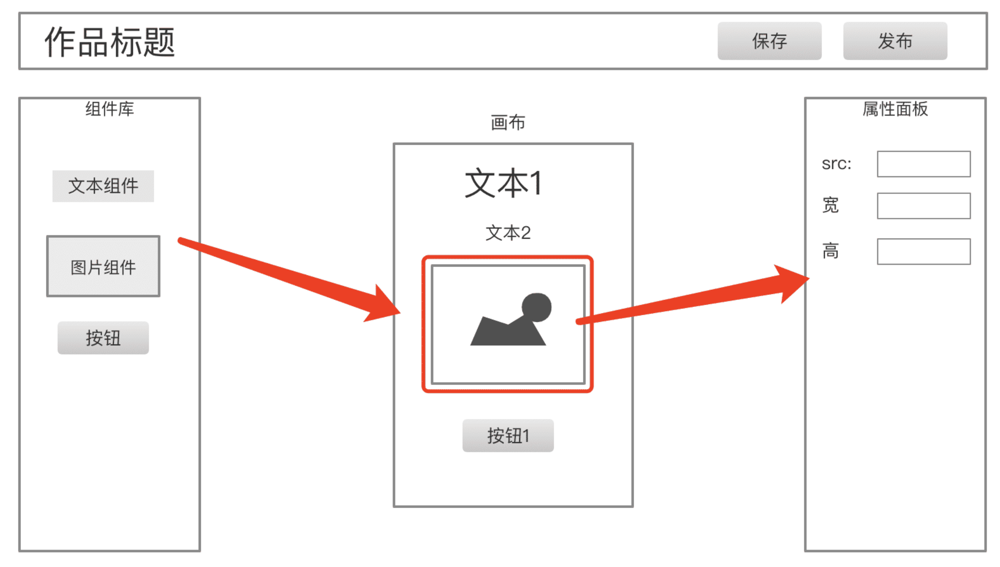

# H5 编辑器

低代码，现在流行

## 题目



这是一个 H5 编辑器，用 vue + vuex 来实现，几个问题：
- 在点“保存”按钮的时候，往服务端传递的**数据结构**是什么样子的？
- 如何保证画布和属性面板是同步更新的？
- 如果在扩展一个“图层”面板，数据结构该怎么设计？

## 大家的答案

第一个问题，大家的答案往往都是这样的：

```js
{
    components: {
        'text1': {
            type: 'text',
            value: '文本1',
            color: 'red',
            fontSize: '16px'
        },
        'text2': {
            type: 'text',
            value: '文本2',
            color: 'red',
            fontSize: '16px'
        },
        'img1': {
            type: 'image',
            src: 'xxx.png',
            width: '100px'
        }
    }
}
```

第二个问题，大家觉得数据存到 vuex 中，就可以同步更新了 —— 这没错，但具体如何做到呢？很多同学想不出来，或者到这里就懵了。

第三个问题，很多同学觉得应该在 vuex store 中新增一个属性

```js
{
    layer: [
        {
            id: 'text1', // 对应到 components 的 key
            name: '文本1'
        },
        {
            id: 'text2',
            name: '文本2'
        }
    ]
}
```

基于以上回答，总结一下：

- node 结构，不是规范的 vnode 形式
- 组件应该用数组，而不是对象。数组是有序结构
- 都知道存储到 vuex 中即可同步数据，但问题是如何用 vuex 表示当前选中的组件
- 图层，应该是一个 computed 计算出来的索引，而不是一个单独的数据

## 正确的设计思路

vuex store

```js
{
    // 作品
    work: {
        title: '作品标题',
        setting: { /* 一些可能的配置项，用不到就先预留 */ },
        props: { /* 页面 body 的一些设置，如背景色 */ },
        components: [
            // components 要用数组，有序结构

            // 单个 node 要符合常见的 vnode 格式
            {
                id: 'xxx', // 每个组件都有 id ，不重复
                name: '文本1',
                tag: 'text',
                attrs: { fontSize: '20px' },
                children: [
                    '文本1' // 文本内容，有时候放在 children ，有时候放在 attrs 或者 props ，没有标准，看实际情况来确定
                ]
            },
            {
                id: 'yyy',
                name: '图片1',
                tag: 'image',
                attrs: { src: 'xxx.png', width: '100px' },
                children: null
            },
        ]
    },

    // 画布当前选中的组件，记录 id 即可
    activeComponentId: 'xxx'
}
```

vuex getter

```js
{
    layers() => {
        store.work.components.map(c => {
            return {
                id: c.id,
                name: c.name
            }
        })
    }
}
```

总之，基本思路就是：

- 每个组件尽量符合 vnode 规范
- 用数组来组织数据，有序
- 尽量使用引用关系，不要冗余

## 扩展

项目技术方案设计时，数据结构的设计是非常重要的。

不要纠细节，看主要设计

要参考现有标准，而非自造标准 —— 这需要自己有基础知识，有识别能力

---

联想到富文本编辑器的数据结构设计：text 摊平，而不是嵌套。
