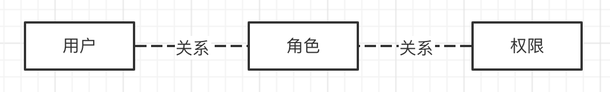
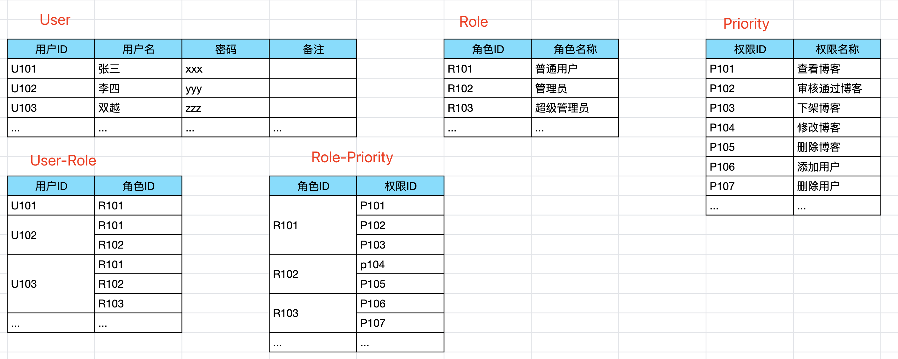

# 权限管理

## 题目

如何设计一个基础的 用户-角色-权限 模型？ 
例如，一个博客管理后台，可以添加很多用户，分配不同的角色，不同角色具有不同权限
- 普通用户：查看博客，审核通过博客，下架博客
- 管理员：修改博客，删除博客 + 普通用户的权限
- 超级管理员：添加用户，删除用户，绑定用户和角色 + 管理员的权限

## 分析

很多公司招聘前端工程师来开发、维护后台管理系统，toB 的系统。角色权限管理是最基本的模块。 
要想成为项目技术负责人，必须要熟知这部分内容的设计。

## RBAC 模型

RBAC - Role-based access control 基于角色的访问控制。它可以满足我们绝大部分管理系统的管理权限控制。

- 三个模型
    - 用户
    - 角色
    - 权限
- 两个关系（以角色为“轴”）
    - 角色 - 用户
    - 角色 - 权限

## 举例

## 功能

用户管理
- 增删改查
- 绑定角色

角色管理
- 增删改查
- 绑定权限

权限管理
- 增删改查

## 答案

RBAC 模型
- 数据结构
- 功能

## 扩展

我刚毕业时，开发一个企业项目管理系统，里面会加很多大家临时想出来的功能。后来我考了 PMP ，才发现很多事情都是已经有了既定解决方案的，不需要自己创新。
