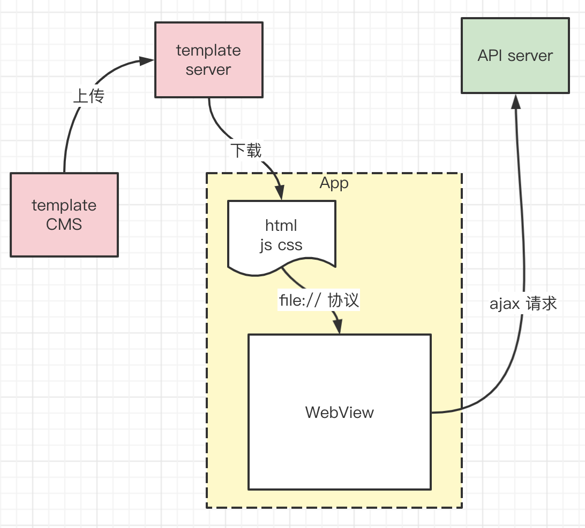
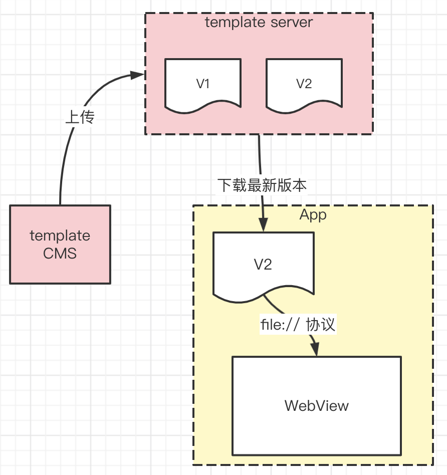

# hybrid 更新机制

## 题目

请设计一个 hybrid 包的更新流程

## hybrid 运作流程

小提示：hybrid html 中 ajax 请求的 url 不能省略协议名称（如 `//xxx.com/api/getInfo`），否则会默认以 `file` 协议请求。必须明确协议名称 `http` 或者 `https`。

## 上传新版本的 hybrid 包

hybrid 包是需要实时更新的，就跟 H5 网上上线一样。更新之后，App 要下载、使用最新版本的 hybrid 包。

何时触发检查、下载最新版本呢？有两种选择
- App 启动时检查、下载
- 实时检查、下载（如每隔 5min）

## 延迟使用

以上两种时机，都会遇到一个问题：如果检查到最新版本，立刻下载使用，可能会影响的性能。
为了避免这个影响，可以考虑“延迟使用”。
- 检测到新版本，先后台下载，目前先使用旧版本
- 待现在完成，再替换为新版本使用

## 答案

- hybrid 基本概念，和基本流程
- 最新包的延迟使用
